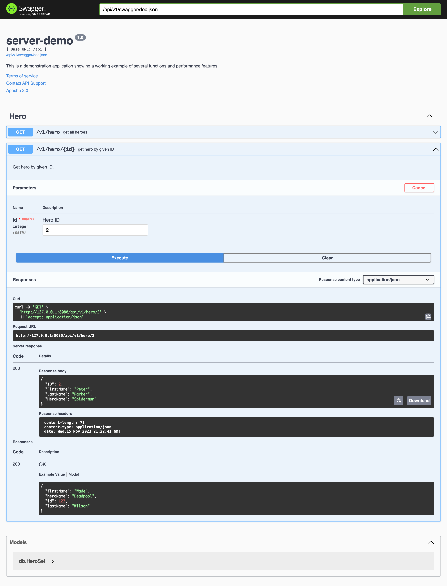

# server-demo


> a server application demo

This is a demonstration application showing a working example of several functions and performance features.

- embedded resources
- webserver / rest api
- cli commands and flags
- config file embed and override function
- binary branding

## flags and operating modes

Operating modes have been implemented for simple control of log outputs, etc. They are intended to set bundled settings (flags) with settings optimized for the mode to ensure optimal operation. The settings apply at runtime, so a restart is required with each change. It is also possible to influence the default settings during binary builds via ld-flags.

### commands

| command      | available values            | defaults | read only | description                                                                     |
| :----------- | :-------------------------- | :------- | :-------: | :------------------------------------------------------------------------------ |
| `completion` | bash, fish, powershell, zsh | ---      |           | returns auto completion script contents for this app to include into your shell |
| `config`     | ---                         | ---      |     ✔     | prints the loaded config values and exits (passwords will be masked)            |
| `runApi`     | ---                         | ---      |     ✔     | starts the integrated web server with current config settings                   |

> ℹ︎ flags commands and flags can be combined.

### flags 

| flag                                               | available values         | defaults | read only | description                                                              |
| :------------------------------------------------- | :----------------------- | :------- | :-------: | :----------------------------------------------------------------------- |
| <nobr>`-f`</nobr><br/><nobr>`--config-file`</nobr> | json config file path    | ---      |           | to override values of embedded [default config data](config/config.json) |
| <nobr>`-m`</nobr><br/><nobr>`--mode`</nobr>        | dev, prod                | dev      |           | operating mode and runs the app                                          |
| <nobr>`-l`</nobr><br/><nobr>`--log-level`</nobr>   | info, warn, error, fatal | info     |           | log level and runs the app                                               |
| <nobr>`--author`</nobr>                            | ---                      | ---      |     ✔     | prints information about the autor and exits                             |
| <nobr>`--company`</nobr>                           | ---                      | ---      |     ✔     | prints information about the manufacturer and exits                      |
| <nobr>`-h`</nobr><br/><nobr>`--help`</nobr>        | ---                      | ---      |     ✔     | prints help text and exits                                               |
| <nobr>`--license`</nobr>                           | ---                      | ---      |     ✔     | prints license text and exits                                            |
| <nobr>`-v`</nobr><br/><nobr>`--version`</nobr>     | ---                      | ---      |     ✔     | prints version number and exits                                          |

## branding

to personalize the binary artifact, we added values like:

- author name
- author email
- company
- version
- license

These values can be overridden at build time by ld-flags.
Some of these values are shown on help screen on the cli or on the website in header and footer sections.

> cli help output

```
INFO[2023-11-15T06:50:40.735] loaded config data                            app=server-demo
                  _         
  _   _    ___   | |   ___  
 | | | |  / _ \  | |  / _ \ 
 | |_| | | (_) | | | | (_) |
  \__, |  \___/  |_|  \___/ 
  |___/                     
---[ server-demo ]---

©2023 yolo

Usage:
  server-demo [command]

Available Commands:
  completion  Generate the autocompletion script for the specified shell
  help        Help about any command
  runApi      Serves the API

Flags:
      --author               
      --company              
  -f, --config-file string   There are 2 ways to load config data: 
                             1. File compiled into binary (embed as defaults)
                             2. load file by flag, 
  -h, --help                 help for server-demo
      --license              
  -l, --log-level string      (default "info")
  -m, --mode string          the application mode (dev,prod) (default "dev")
  -v, --version

Use "server-demo [command] --help" for more information about a command.
```

## website

the website layout is based on generic css styles (breadth by [templated.co](https://templated.co/breadth/)) and made dynamic fiber's implementation of go templates.


## api

the api gives a short view on how a db (simulated by [go-memdb](https://github.com/hashicorp/go-memdb) to keep all inside this binary) can be used to provide a very simple rest api. 

### swagger

the swagger docs are provided by [fiber-swagger](https://github.com/arsmn/fiber-swagger).

> ℹ︎ including swagger docs are available in `dev mode` only

to generate and update swagger docs, you need an additional tool. Please make sure your `$GOPATH/bin` path is defined inside your `$PATH` variable

```
$> go install github.com/swaggo/swag/cmd/swag@latest
```

after that you can build your docs with this command

```
$> swag init
```

now you restart the app and enjoy the new features you just created.




that's all, folks. Happy coding!